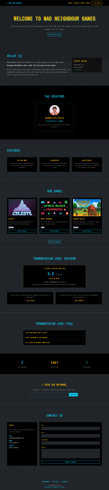

# MadNeighbour Games - Company Profile
Studio game indie yang berfokus menciptakan game mobile kasual, permainan teka-teki santai, dan mini-games yang seru untuk semua kalangan (Project Ujian Tengah Semester).

## Referensi Desain:
- **Konsep Visual Utama:** Menggunakan estetika retro VHS dan VCR OSD (On-Screen Display) yang terinspirasi dari visual game "Fears to Fathom", namun diaplikasikan pada tema perusahaan game kasual.
- **Poolsuite (poolsuite.net):** Referensi tata letak untuk antarmuka sistem operasi lawas dan penerapan efek layar CRT (monitor tabung) yang mempertahankan nuansa menyenangkan dan kasual.
- **Dribbble (Pencarian "Retro VCR UI"):** Referensi untuk pemilihan palet warna gelap (Dark Mode), tipografi monospace (font digital jadul), dan tombol bergaya analog.

## Screenshot FullPage:

